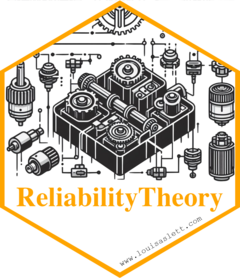

# ReliabilityTheory 

[](http://www.repostatus.org/#active)
[](http://www.gnu.org/licenses/gpl-2.0.html)
[](https://cran.r-project.org/package=ReliabilityTheory)
[](https://cran.r-project.org/package=ReliabilityTheory)
[](https://louisaslett.r-universe.dev/ReliabilityTheory)

The `{ReliabilityTheory}` package provides a variety of tools useful for performing structural reliability analysis, such as when using the structure function, system signature or survival signature.

## Contact

Please feel free to:

* submit suggestions and bug-reports at: <https://github.com/louisaslett/ReliabilityTheory/issues>
* compose an e-mail to: <louis.aslett@durham.ac.uk>

## Install stable release

You can install the latest release directly from [CRAN](https://cran.r-project.org/package=ReliabilityTheory) as follows:

```r
install.packages("ReliabilityTheory")
```

## Install development version

You can install the latest version from [R-universe](https://louisaslett.r-universe.dev/ReliabilityTheory) as follows:

```r
install.packages("ReliabilityTheory", repos = c("https://louisaslett.r-universe.dev", "https://cran.r-project.org"))
```

Alternatively, you can install directly from [GitHub](https://github.com) using the [`{remotes}`](https://cran.r-project.org/package=remotes) package as follows:

```r
install.packages("remotes")
remotes::install_github("louisaslett/ReliabilityTheory")
```

Under releases, the tree/commit from which CRAN releases were made are recorded, so historic source can be downloaded from there.

## Citation

If you use this software, please cite one of the following:

Aslett, L. J. M. (2012), *ReliabilityTheory: Tools for structural reliability analysis*.  R package, `www.louisaslett.com`

Aslett, L. J. M. (2012), MCMC for Inference on Phase-type and Masked System Lifetime Models, PhD thesis, Trinity College Dublin.

Thank-you.
